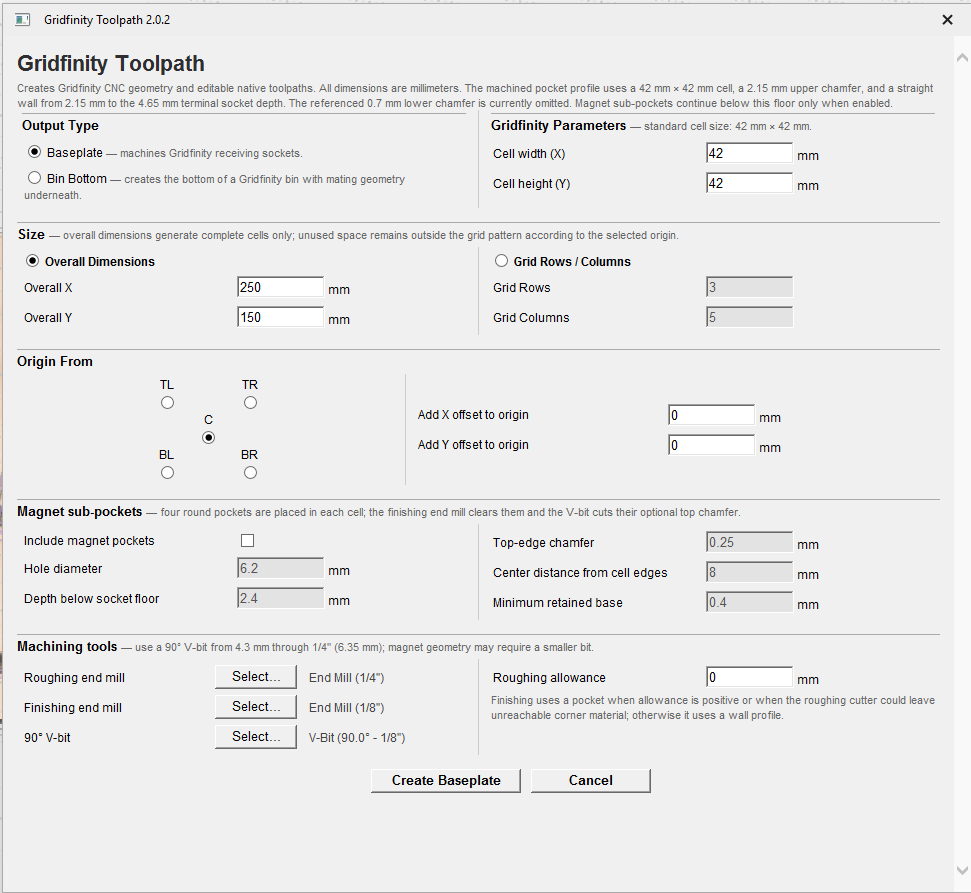

# Gridfinity Toolpath Gadget for VCarve

Creates editable native Vectric toolpaths for either of these Gridfinity parts:

- **Baseplate** — negative receiving sockets machined into the material.
- **Filler Plate** — a removable flat cover with positive mating feet machined
  underside-up, followed by a tabbed outside cutout.

The gadget is tested in VCarve Pro. It uses the shared Vectric V12 Gadget API
and is expected to work in Aspire, but Aspire remains unverified. It supports
metric and inch jobs, custom cell pitch, two sizing modes, five origin anchors,
offsets, and optional four-hole magnet patterns. All values entered in the
gadget are millimeters; tools may use either millimeter or inch units in the
Vectric tool database.



## Requirements

- VCarve Pro with Gadget support (V12 SDK API); Aspire is currently unverified.
- A single-sided, flat job with its actual stock dimensions and thickness set.
- A roughing end mill, finishing end mill, and 90-degree V-bit.
- Positive tool stepdowns and positive end-mill stepovers.

A 1/4-inch roughing end mill, 1/8-inch finishing end mill, and 1/4-inch
90-degree V-bit are practical socket-only Baseplate starting choices. Baseplate
magnet geometry may require a smaller V-bit. Filler Plates also need a narrower
V-bit; 1/8 inch is supported there.
Always verify tool numbers, feeds, speeds, stepdowns, safe Z, and the 3D preview
before posting code.

## Install

Download `Gridfinity_Toolpath_<version>.vgadget` from a release, then choose
**Gadgets → Install New Gadget…** in VCarve Pro or Aspire.

To build the installer locally:

```sh
./scripts/build-vgadget.sh
```

This writes `dist/Gridfinity_Toolpath.vgadget`. The archive contains the
required top-level `Gridfinity_Toolpath` directory and is checked with
`unzip -t` before the build succeeds.

To rebuild automatically whenever a gadget source file changes:

```sh
make watch-start
```

Use `make watch-status` to inspect the watcher and `make watch-stop` to stop it.
Build output is written to `dist/build-watch.log`.

GitHub Actions tests and packages the gadget on every push and pull request.
Tags matching `v*` create a GitHub Release with a versioned installer.

## Shared layout options

Both output types use the same placement rules. Filler Plates allow the plate
boundary and grid count to be specified independently.

### Cell size

Cell width and height are independently adjustable and default to 42 mm. The
nominal profiles keep their fixed edge clearances and slopes as the pitch
changes, so very small custom cells may be rejected when the profile or tools
no longer fit.

### Baseplate size by Grid Rows / Columns

The physical boundary is exactly:

```text
width  = columns × cell width
height = rows × cell height
```

Rows and columns must each be between 1 and 100.

### Baseplate size by Overall Dimensions

Overall X and Y define the exact physical boundary. Only complete cells are
generated inside it:

```text
columns = floor(overall X / cell width)
rows    = floor(overall Y / cell height)
```

Each direction must fit at least one complete cell. Unused width or height is
outside the complete-cell pattern but remains part of the physical boundary.
For example, 100 × 85 mm at the standard pitch creates an exact 100 × 85 mm
boundary containing a 2 × 2, 84 × 84 mm foot or socket pattern.

For a Filler Plate, Overall X/Y and Grid Rows/Columns are both editable. The
overall dimensions set the plate boundary; the counts set the foot pattern.
The first sizing field edited in the dialog sets the calculation direction:
editing overall dimensions calculates grid counts, while editing grid counts
calculates overall dimensions. Later edits to the calculated fields do not
change the values entered first.
The complete grid must fit inside the plate. For example, a 307 × 354 mm
plate can contain 7 columns × 8 rows of 42 mm cells (294 × 336 mm), leaving
13 mm of width and 18 mm of height outside the pattern. The selected origin
determines how those margins are placed.

### Origin and offsets

The selected anchor—Top Left, Top Right, Center, Bottom Left, or Bottom
Right—is placed at the VCarve job's actual XY origin plus the entered X and Y
offsets. In Overall Dimensions mode, unused space is positioned on the sides
implied by that anchor; Center divides it equally.

Only the physical boundary must fit inside the job. Filler Plate helper vectors
and cutter centerlines may extend beyond it; the gadget permits those portions
of a toolpath to cut air. Consequently, a plate boundary may exactly fill the
VCarve job.

## Baseplate behavior

The negative socket follows the
[Gridfinity Design Reference](https://gridfinity.xyz/assets/img/spec_draft_willtree8.jpg):
a 42 mm nominal pitch, 2.15 mm upper chamfer, 1.8 mm vertical wall, and 4.65 mm
terminal depth. The referenced 0.7 mm lower chamfer is intentionally omitted;
the end mills continue the 37.2 mm wall profile to the terminal depth.

The Baseplate normally creates:

1. `Gridfinity 1 - Rough` — rough pocket with the requested radial and axial
   allowance.
2. `Gridfinity 2 - Finish` — wall profile when zero allowance and the cutter
   combination can clear the rougher's corner remnant; otherwise a complete
   finishing pocket.
3. `Gridfinity 3 - 45deg Socket Chamfers` — 2.15 mm seating chamfer.

With magnets enabled, magnet pockets become operation 3, the socket chamfer
becomes operation 4, and a positive magnet chamfer adds operation 5. Magnet
pockets continue below the 4.65 mm socket floor.

Baseplate geometry uses these layers:

- `Gridfinity - Socket Outer Edge`
- `Gridfinity - Socket Inner Edge`
- `Gridfinity - Magnet Outer Edge` when magnets are enabled
- `Gridfinity - Magnet Inner Edge` when magnets are enabled

The Baseplate requires a 90-degree V-bit from 4.3 through 6.35 mm. When magnets
are enabled, their chamfer must not be deeper than the pocket, holes and
chamfers must not overlap, and the complete feature must fit the rounded socket
floor. The gadget also checks the V-bit's swept cone at critical socket depths.
A valid socket-only V-bit can therefore be rejected for a particular magnet
diameter, chamfer, or inset; use a smaller V-bit, smaller magnet feature, or move
the magnet centers inward.

## Filler Plate setup and geometry

Select **Filler Plate** and machine the stock underside-up. The material surface
is the exposed bottom face of the feet; positive depth proceeds inward toward
the recessed plate interface.

Each nominal foot has:

| Feature | Dimension or depth |
| --- | ---: |
| Foot bottom | 35.6 mm with 0.8 mm corner radius |
| Lower chamfer | 0.8 mm deep |
| Vertical wall | 37.2 mm wide and 1.8 mm high |
| Upper chamfer | 2.15 mm deep |
| Foot top at plate interface | 41.5 mm with 3.75 mm corner radius |
| Plate interface depth | 4.75 mm from the stock surface |

At the standard 42 mm pitch, adjacent foot tops have a nominal 0.5 mm
separation. The plate boundary is independent of the complete-cell pattern, so
Overall Dimensions margins remain part of the final plate.

Filler geometry is organized on these primary layers:

- `Gridfinity - Filler Plate Boundary`
- `Gridfinity - Filler Foot Top Edge`
- `Gridfinity - Filler Foot Wall Edge`
- `Gridfinity - Filler Foot Bottom Edge`

The gadget also creates derived rough/finish clearance boundaries and one layer
for each V-bit chamfer pass. Multi-cell plates add `Gridfinity - Filler Upper
Chamfer Seam Pass`. Enabled magnets use the shared magnet edge layers.

## Filler Plate operation sequence

The exact operation count varies with tool diameter, allowance, cell count, and
magnet settings. Operations that apply are created in this order:

| Order | Operation | Tool | Depth and behavior | When included |
| ---: | --- | --- | --- | --- |
| 1 | Rough Clearance | Roughing end mill | Pockets accessible space around 41.5 mm foot-top islands to 4.75 mm. Leaves the selected allowance radially. | When the rough tool plus twice the allowance fits between foot tops or in an unused full-cell band at the plate edge. |
| 2 | Wall Clearance | Finishing end mill | Pockets from 0 to 2.6 mm around the 37.2 mm wall contours. When Rough Clearance runs, this pocket is limited to the exact grid rectangle. After complete zero-allowance roughing, it instead profiles the walls. | Always. |
| 3 | Vertical Walls | Finishing end mill | Outside profile from 0.8 to 2.6 mm, preserving the 1.8 mm wall. It follows Wall Clearance to finish wall edges the pocket cannot reach. | Omitted when the Wall Clearance operation already profiles the wall. |
| 4 | Finish Clearance | Finishing end mill | When Rough Clearance runs, profiles outside the 41.5 mm foot-top contours from 2.6 to 4.75 mm to finish the rougher's remaining scallops. Otherwise, pockets the plate-interface area to the same depth. | Always. |
| 5 | Magnet Pockets | Finishing end mill | Pockets inward from the exposed foot face to the selected depth. | Magnets enabled. |
| 6 | Lower Chamfer Passes | 90° V-bit | One or more profile-on passes spanning 0 to 0.8 mm. | Always. |
| 7 | Upper Chamfer Passes | 90° V-bit | One or more profile-on passes spanning 2.6 to 4.75 mm. | Always. |
| 8 | Upper Chamfer Seam Pass | 90° V-bit | Open centerlines reach a 5.0 mm tip depth, allowing the cone to remove the 0.5 mm interface separation without deepening the closed foot contours. | More than one row or column. |
| 9 | Magnet Chamfers | 90° V-bit | Profile-on pass from the exposed face to the selected chamfer depth. | Magnets enabled and chamfer greater than zero. |
| 10 | Rough Outside Cutout | Roughing end mill | Outside profile on the true plate boundary through the full stock thickness, with four 3D tabs. | Always and always last unless a finish cutout follows. |
| 11 | Finish Outside Cutout | Finishing end mill | Outside profile through the full stock thickness using the same tabs. | Only when Rough Clearance was included and roughing allowance is positive. |

The table's order numbers describe the sequence, not the numeric suffix in every
generated toolpath name. Omitted conditional operations close the numbering
gaps automatically.

For example, the following counts assume standard 42 mm cells, a 3.175 mm
finisher, a 3.175 mm 90-degree V-bit (one lower and two upper chamfer passes),
and 0.2 mm allowance:

| Example | Generated operations |
| --- | ---: |
| 1 × 1, 6.35 mm rougher, magnets off | 7 |
| 2 × 2, 6.35 mm rougher, magnets off | 8 |
| 2 × 2, 6.35 mm rougher, magnets on, zero magnet chamfer | 9 |
| 2 × 2, 6.35 mm rougher, magnets on, positive magnet chamfer | 10 |
| 2 × 2, 3.0 mm rougher, magnets off | 8 |

The 3.0 mm rougher cannot fit between the 41.5 mm foot tops, so it does not
add Rough Clearance or Finish Outside Cutout on an exact 2 × 2 grid.

### Clearance behavior and cutter fit

The finish clearance stages are checked independently of Rough Clearance. If
the roughing cutter cannot fit between foot tops, it can still clear an unused
full-cell band at the plate edge where the cutter fits. Wall Clearance pockets
the narrow gaps the rougher cannot enter. When Rough Clearance runs, Wall
Clearance uses the exact grid rectangle and Finish Clearance profiles the
foot-top contours, so neither repeats the wide outer band. Wall, chamfer, seam, and magnet vectors are
also within the grid. Outside cutouts still follow the physical plate boundary.

With zero roughing allowance, Wall Clearance uses a finishing profile when the
roughing cutter fits all internal foot-top gaps. This avoids repeating the full
pocket while still finishing the wall contour. The separate Vertical Walls
profile is omitted when Wall Clearance already profiles the same walls.

For standard 42 mm cells, the 41.5 mm foot tops leave 0.5 mm between adjacent
top profiles. Rough Clearance is included when either condition holds:

```text
roughing-tool diameter + 2 × roughing allowance ≤ top-to-top clearance

or

unused plate width or height ≥ one cell width or height, respectively
and roughing-tool diameter + 2 × roughing allowance
  ≤ the corresponding foot-top-to-plate-edge clearance
```

Consequently, a 6.35 mm (1/4-inch) rougher can run Rough Clearance on a
307 × 354 mm plate with a centered 7 × 7 grid: the unused 60 mm height is
split into 30 mm bands above and below the feet. It skips Rough Clearance
with a 7 × 8 grid, which has no full-cell band. A 3.175 mm (1/8-inch)
finishing end mill clears the internal wall gaps in both layouts.

The finishing end mill must fit the wall spacing. Tool-specific expanded outer
boundaries let clearance cutters reach or pass the true plate edge; the plate
boundary itself is not treated as a pocket containment wall. Expanded paths
may extend beyond the job and cut air; only the true plate boundary is checked
against the job size.

### Chamfer behavior

The V-bit diameter determines how many derived lower- and upper-chamfer passes
are required. Filler Plates require a 90-degree V-bit within 0.5 degree and no
larger than 4.3 mm; a wider cone can cut into the finished vertical wall.

A plate with more than one row or column also requires a V-bit at least 0.5 mm
in diameter. Its final upper-chamfer seam pass follows every internal row and
column centerline to a 5.0 mm tip depth. A 1 × 1 plate has no internal seam pass.

### Outside cutout and tabs

The cutout is deliberately last so the plate remains held during pockets,
walls, magnets, and chamfers. The roughing tool profiles outside the exact
physical boundary through the full material thickness. Four 3D tabs—one
centered on each straight side—are 10 mm long and 2 mm thick.

At zero roughing allowance, the rough cutout follows the final plate boundary
and is the only cutout operation, whether or not Rough Clearance ran. With
positive allowance and Rough Clearance, the rough cutout leaves the selected
allowance and a finishing-end-mill outside profile brings the edge to size.
Both cutout paths retain the same tabs when both are generated.

## Filler Plate magnets

When **Include magnet pockets** is off, no magnet vectors or toolpaths are
created. Existing gadget magnet layers are cleared when the filler geometry is
regenerated.

When enabled, four holes are placed in every complete cell. **Center distance
from cell edges** locates each center inward from its two nearest cell edges.
Pocket depth is measured from the exposed foot face, not from the recessed plate
interface.

The gadget validates that:

- hole diameter and depth are positive;
- chamfer is non-negative, smaller than the hole radius, and no deeper than the
  pocket;
- pocket depth does not exceed the 4.75 mm foot height;
- inset is positive and less than half the smaller cell dimension;
- the hole and chamfer fit inside the 35.6 mm rounded foot bottom;
- holes do not overlap; and
- the finishing end mill is smaller than the hole diameter.

A zero magnet chamfer creates pockets without a Magnet Chamfers operation.

## Filler Plate stock thickness

**Minimum flat-top thickness** is enforced whether or not magnets are enabled.
It is the material retained beyond the deepest foot-forming V-bit operation:

| Layout | Minimum stock thickness | Default with 0.4 mm flat top |
| --- | --- | ---: |
| 1 × 1 | `4.75 mm + minimum flat-top thickness` | 5.15 mm |
| Multiple rows or columns | `5.0 mm + minimum flat-top thickness` | 5.4 mm |

The through-cut outside profile is intentionally excluded from this retained
flat-top calculation because its tabs keep the plate connected to the stock.
The current VCarve material thickness is used for validation and for the cutout
depth; there is no separate stock-thickness field in the gadget.

## Validation and regeneration

The gadget validates the complete operation plan before it changes filler
layers or creates filler toolpaths. Common reasons for rejection include:

- the true physical layout boundary outside the VCarve job;
- insufficient stock thickness;
- missing tools or invalid tool cutting parameters;
- negative or at least 1 mm roughing allowance;
- a finishing cutter too large for wall clearance or enabled magnet holes;
- a V-bit with the wrong angle or unsafe diameter; and
- invalid or overlapping magnet geometry.

Every native toolpath uses a layer-based vector selector and can be edited or
recalculated in VCarve. Re-running the gadget clears and replaces its named
geometry layers, including stale optional layers, but adds another set of
toolpaths. Before a rerun, delete existing toolpaths whose names begin with
`Gridfinity`; it is not necessary to delete the gadget's vector layers. The
gadget deliberately does not delete existing toolpaths automatically because it
cannot reliably distinguish renamed or similarly named user-created paths.

If a Filler Plate toolpath fails during creation, or a later Baseplate toolpath
fails, toolpaths already created by that run are removed. The regenerated
geometry remains available for inspection. This rollback does not remove paths
from earlier successful runs.

Always inspect the VCarve 3D preview before machining. For a Filler Plate,
confirm that the stock surface is the exposed foot face, the lower and upper
slopes face the correct direction, the vertical wall is 1.8 mm high, the plate
interface is 4.75 mm deep, seam cleanup appears only between cells, magnets open
from the exposed face, the outside path is on the correct side, and all four
tabs remain.

The current Filler Plate has undergone extensive VCarve preview testing. A
physical cut and fit test has not yet been completed, so version 2.0.2 should be
treated as preview-tested rather than physically validated. Aspire compatibility
also remains unverified.

## Development

Run the pure geometry tests and Lua syntax check:

```sh
make test
```

Build and verify the installer:

```sh
make build
unzip -t dist/Gridfinity_Toolpath.vgadget
```

Version 1.1 and later use standard Vectric pocket and profile toolpaths instead
of external toolpaths. The
[FreeCAD Gridfinity Workbench](https://github.com/Stu142/FreeCAD-Gridfinity-Workbench)
is used only as a parameter reference for configurable baseplates and magnets;
it produces positive solids, while this gadget produces CNC vectors and
toolpaths.
